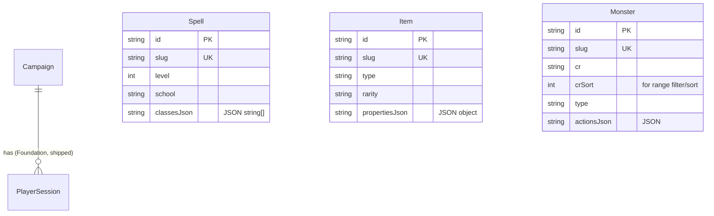

# SA Blueprint — 5e Reference (Sprint 1)

> แปลง [PRD](./PRD.md) เป็นพิมพ์เขียวพร้อมโค้ด สำหรับ `/dev`
> **Constraints (ล็อกแล้ว ห้ามแก้):** [ARCHITECTURE](../../program/ARCHITECTURE.md) (Next.js 16 App Router + TS · SQLite + Prisma 6 · reference = REST route handlers ไม่ใช่ socket.io · single local host · offline) · [DATA_MODEL](../../program/DATA_MODEL.md) (โมดูลนี้ owns `Spell`/`Item`/`Monster`)

## หลักการออกแบบ (สรุปการตัดสินใจ)
1. **Global reference tables — ไม่มี `campaignId`.** SRD ใช้ร่วมทุกแคมเปญ (ต่างจาก Foundation ที่ทุกแถวมี `campaignId`). อ่านอย่างเดียว seed ครั้งเดียว.
2. **Natural key = `slug`** (`@unique`, เช่น `"fireball"`, `"goblin"`, `"longsword"`) → seed แบบ **idempotent upsert** + ใช้เป็น deep-link param (`/reference/spells/fireball`).
3. **Hybrid columns:** ฟิลด์ที่ใช้ **กรอง/เรียง** = คอลัมน์จริง + index (`level`, `school`, `cr`, `type`, `rarity`). ฟิลด์ซ้อน/หลายค่า/แสดงอย่างเดียว (`components`, `classes`, `actions`, `traits`, `properties`) = **JSON string column** (SQLite ไม่มี native JSON/array; Prisma `String` เก็บ `JSON.stringify`). หลีกเลี่ยง join table ที่ไม่จำเป็น เพราะ filter ทำฝั่ง client อยู่แล้ว.
4. **Read path = REST route handlers** คืน list เต็มต่อหมวด → client กรองใน memory (< 100ms ตาม PRD §6.1). ไม่มี socket.io.
5. **เพิ่มผ่าน additive migration `5e_reference`** บน `foundation_baseline` — สร้างตารางใหม่ล้วน ไม่แตะ migration เดิม.

---

## 1. ER Diagram



> ทั้ง 3 ตาราง **ยืนอิสระ** ไม่มี FK ในสปรินต์นี้ — เป็น master data ที่โมดูลหลังจะ "ชี้มา" (CharacterSpell→Spell, CharacterItem→Item, Combatant→Monster) ผ่าน additive migration ของสปรินต์นั้น ๆ

---

## 2. Database Schema Definition

### 2.1 Prisma models (เพิ่มต่อท้าย `prisma/schema.prisma`)

```prisma
// ── 5e Reference (Sprint 1) ─────────────────────────────────────────
// GLOBAL SRD 5.1 reference data (CC-BY-4.0). NO campaignId — shared across all campaigns.
// Read-mostly; seeded idempotently by `slug`. Multi-value/nested fields = JSON strings
// (SQLite has no native array/JSON). Filterable scalars are real columns + indexed.

model Spell {
  id          String  @id @default(cuid())
  slug        String  @unique           // natural key + deep-link param ("fireball")
  name        String
  level       Int                        // 0 = cantrip .. 9
  school      String                     // "Evocation" | ...
  castingTime String
  range       String
  duration    String
  components   String                    // JSON: { v: bool, s: bool, m: string|null }
  ritual      Boolean @default(false)
  concentration Boolean @default(false)
  description String                     // full rules text (multi-paragraph)
  higherLevels String?                   // "At Higher Levels" text, nullable
  classesJson String                     // JSON string[]: ["Sorcerer","Wizard"]
  source      String  @default("SRD 5.1")

  @@index([level])
  @@index([school])
  @@index([name])
}

model Item {
  id              String  @id @default(cuid())
  slug            String  @unique
  name            String
  type            String                 // "weapon" | "armor" | "adventuring-gear" | "tool" | ...
  rarity          String  @default("mundane") // "mundane"|"common"|"uncommon"|"rare"|"very-rare"|"legendary"
  requiresAttunement Boolean @default(false)
  propertiesJson  String  @default("{}") // JSON: { damage, versatile, weight, cost, armorClass, ... }
  description     String?
  source          String  @default("SRD 5.1")

  @@index([type])
  @@index([rarity])
  @@index([name])
}

model Monster {
  id              String  @id @default(cuid())
  slug            String  @unique
  name            String
  size            String                 // "Tiny".."Gargantuan"
  type            String                 // "humanoid" | "beast" | "dragon" | ... (14)
  alignment       String
  cr              String                 // display: "1/4", "0", "5" (fractions kept as text)
  crSort          Float                  // numeric for range filter/sort (1/4 -> 0.25)
  xp              Int     @default(0)     // derived from CR (deterministic, precomputed at seed)
  ac              Int
  acNote          String?                // "(natural armor)"
  hp              Int
  hpFormula       String?                // "2d6"
  speed           String                 // "30 ft., fly 60 ft."
  abilityScores   String                 // JSON: { str,dex,con,int,wis,cha }
  savesJson       String  @default("{}") // JSON: { dex:"+2", ... }
  skillsJson      String  @default("{}") // JSON: { stealth:"+6", ... }
  senses          String?
  languages       String?
  immunitiesJson  String  @default("{}") // JSON: { damage:[], condition:[] }
  resistancesJson String  @default("[]")
  traitsJson      String  @default("[]") // JSON: [{ name, desc }]
  actionsJson     String  @default("[]") // JSON: [{ name, desc }]  (incl. legendary/reactions w/ a kind field)
  source          String  @default("SRD 5.1")

  @@index([crSort])
  @@index([type])
  @@index([size])
  @@index([name])
}
```

### 2.2 ตารางอ้างอิงคอลัมน์ (สำหรับ DATA_MODEL — ดู §6 การ amend)
ครบตาม PRD §4.1–4.3 — รายละเอียดเหมือน Prisma ข้างบน

### 2.3 Migration
- ชื่อ: **`5e_reference`** (`prisma migrate dev --name 5e_reference`)
- เนื้อหา: `CREATE TABLE "Spell" / "Item" / "Monster"` + `CREATE INDEX` ตามด้านบน — **ตารางใหม่ล้วน ไม่ ALTER ของเดิม** → backward-compatible 100% กับ Foundation
- `foundation_baseline` ไม่ถูกแตะ

---

## 3. SRD 5.1 Seed Pipeline

### 3.1 แหล่งข้อมูล (แนะนำ)
- **`5e-bits/5e-database`** (github.com/5e-bits/5e-database) — ชุด JSON ของ **SRD 5.1** ที่ normalize ดี ใช้เป็น backend ของ open5e/dnd5eapi เผยแพร่ใต้ **MIT (โค้ด) + เนื้อหา SRD CC-BY-4.0** ครบ spells/equipment/magic-items/monsters
- ทางเลือก: **open5e** API/dump — โครงคล้ายกัน
- **วิธีใช้:** ดึงไฟล์ JSON ที่ต้องการมา **vendor เก็บในรีโป** (ไม่ fetch ตอน build/seed — ต้อง offline ได้) ไว้ที่:
  ```
  prisma/seed/data/spells.json
  prisma/seed/data/items.json        (equipment + magic-items รวม/normalize)
  prisma/seed/data/monsters.json
  prisma/seed/SRD-5.1-CC-BY-4.0.md   (ตัวบทไลเซนส์ + ข้อความ attribution)
  ```

### 3.2 สคริปต์ seed
- ไฟล์: `prisma/seed/index.ts` (+ helper `transform.ts` แปลง shape ของ source → schema เรา)
- ลงทะเบียนใน `package.json`:
  ```json
  "prisma": { "seed": "tsx prisma/seed/index.ts" },
  "scripts": { "db:seed": "prisma db seed", "db:reset": "prisma migrate reset" }
  ```
- **Idempotent upsert by `slug`** → รันซ้ำได้ ไม่ซ้ำแถว:
  ```ts
  await prisma.spell.upsert({ where: { slug }, create: row, update: row });
  ```
- **เร็ว & re-runnable:** ห่อเป็น `prisma.$transaction([...])` แบ่ง batch (เช่น ก้อนละ 100) หรือใช้ `createMany` + `deleteMany` ถ้าต้องการ refresh ทั้งชุด (reference เป็น read-only จึง replace-all ก็ปลอดภัย) — แนะนำ upsert เพื่อ stable id
- **Deterministic derived values คำนวณตอน seed** (ตาม ARCHITECTURE "rules math = code"): `xp` จาก `cr` (ตาราง CR→XP), `crSort` จากเศษส่วน (`"1/4"`→0.25), modifier ไม่ต้องเก็บ (คำนวณจาก score ตอน render)
- เรียกหลัง migrate: `npm run db:migrate` → `npm run db:seed`

### 3.3 Transform notes
- map `components` (source มักเป็น array `["V","S","M"]` + `material`) → `{ v, s, m }`
- `classes` → `classesJson` (string[])
- monster `actions`/`legendary_actions`/`reactions` → รวมเป็น `actionsJson` โดยใส่ฟิลด์ `kind: "action"|"legendary"|"reaction"`
- ค่า slug: ใช้ของ source ถ้ามี ไม่งั้น `slugify(name)`

---

## 4. API Contracts (REST / Next route handlers)

> ทั้งหมดเป็น **read-only GET** ใต้ `app/api/reference/` — ตาม ARCHITECTURE (reference reads = route handlers, ไม่ broadcast)

| Method | Endpoint | ผลลัพธ์ | หมายเหตุ |
|--------|----------|---------|----------|
| GET | `/api/reference/spells` | `SpellListItem[]` (ทั้งหมด, fields พอสำหรับ list+filter) | client กรองเอง |
| GET | `/api/reference/spells/[slug]` | `SpellDetail` | deep-link / detail |
| GET | `/api/reference/monsters` | `MonsterListItem[]` | |
| GET | `/api/reference/monsters/[slug]` | `MonsterDetail` (statblock เต็ม) | |
| GET | `/api/reference/items` | `ItemListItem[]` | |
| GET | `/api/reference/items/[slug]` | `ItemDetail` | |

### 4.1 Response types (`lib/reference/types.ts`)
```ts
// list = lean payload (เฉพาะที่ใช้แสดงแถว+กรอง) เพื่อ payload เล็ก
export interface SpellListItem {
  slug: string; name: string; level: number; school: string;
  castingTime: string; ritual: boolean; concentration: boolean; classes: string[];
}
export interface SpellDetail extends SpellListItem {
  range: string; duration: string; components: { v: boolean; s: boolean; m: string | null };
  description: string; higherLevels: string | null; source: string;
}
export interface MonsterListItem {
  slug: string; name: string; cr: string; crSort: number;
  type: string; size: string; hp: number; ac: number;
}
export interface MonsterDetail extends MonsterListItem {
  alignment: string; xp: number; acNote: string | null; hpFormula: string | null; speed: string;
  abilityScores: Record<"str"|"dex"|"con"|"int"|"wis"|"cha", number>;
  saves: Record<string,string>; skills: Record<string,string>;
  senses: string | null; languages: string | null;
  immunities: { damage: string[]; condition: string[] }; resistances: string[];
  traits: { name: string; desc: string }[];
  actions: { name: string; desc: string; kind: "action"|"legendary"|"reaction" }[];
  source: string;
}
export interface ItemListItem {
  slug: string; name: string; type: string; rarity: string; requiresAttunement: boolean;
}
export interface ItemDetail extends ItemListItem {
  properties: Record<string, unknown>; description: string | null; source: string;
}
```

### 4.2 Caching (ข้อมูล static หลัง seed)
- ข้อมูลไม่เปลี่ยนระหว่าง runtime → cache ได้แรง 3 ชั้น:
  1. **In-memory module cache** ใน `lib/reference/repo.ts`: query DB ครั้งแรกแล้วเก็บ array ไว้ใน module-scope (process เดียว, host เดียว) — request ถัด ๆ ไม่แตะ DB.
  2. Route handler ใส่ `export const dynamic = "force-static"` + header `Cache-Control: public, max-age=31536000, immutable` (ออฟไลน์ฝั่ง browser ก็ได้ประโยชน์).
  3. ฝั่ง client `fetch` ต่อหมวด **ครั้งเดียว** แล้วถือ array ไว้ (กรองใน memory).
- ผล: เปิดแท็บแรกยิง 1 request/หมวด ที่เหลือ instant.

### 4.3 Repository layer
- `lib/reference/repo.ts` — `getSpells()/getSpell(slug)/getMonsters()/…` อ่านจาก Prisma + parse JSON columns → typed objects (แปลง `classesJson` → `classes` ฯลฯ). route handler เรียก repo เท่านั้น (ไม่ Prisma ตรง ๆ ใน handler)

---

## 5. Security & Auth
- **เข้าถึงเมื่ออยู่ใน session แคมเปญ** (ตาม PRD §2.2 / Foundation): หน้า `/reference/*` เป็น client page ภายใต้ provider เดียวกับ lobby; ถ้าไม่มี seat → redirect `/join` (เหมือน lobby guard ปัจจุบัน). route handler เป็น read-only ข้อมูลสาธารณะ (กฎเกม) → ไม่ต้อง authz ระดับแถว แต่ไม่ผูก `campaignId` จึงไม่มีการรั่วข้ามแคมเปญโดยนิยาม.
- ไม่มี PII, ไม่มี mutation → ผิวสัมผัสความปลอดภัยต่ำ
- **License compliance** (functional): route/หน้า Reference แสดง attribution CC-BY-4.0 (PRD §6.3); เก็บไฟล์ไลเซนส์ใน `prisma/seed/`

---

## 6. การ amend `docs/program/DATA_MODEL.md`
แทนที่ stub 3 section (#spell/#item/#monster) ด้วยตารางคอลัมน์ฉบับ finalized + mark **"Finalized (Sprint 1, migration `5e_reference`)"** — **คง Entity Catalog เดิมไว้** (จะทำในขั้นตอนถัดไปทันทีหลังไฟล์นี้)

## 7. Technical Notes / Best Practices
- **JSON columns**: เขียน helper `parseJson<T>(s, fallback)` กัน JSON เสีย (PRD edge 5.6) — parse ที่ repo layer ครั้งเดียว
- **slug escape ใน search**: client filter ใช้ `string.includes(lowercased)` ไม่ใช่ regex → กัน edge 5.7 อัตโนมัติ
- **crSort**: เก็บ Float เพื่อ range filter (`>= min && <= max`) ส่วน `cr` string ใช้แสดง ("1/8")
- **ไม่ใส่ campaignId** — ย้ำ: ตารางพวกนี้ห้ามมี campaignId มิฉะนั้นจะ seed ซ้ำต่อแคมเปญและผิดสถาปัตยกรรม
- **อย่าทำ DB query ต่อ keystroke** — โหลดทั้งชุด/หมวดครั้งเดียว (PRD §6.1)
- **Test seam**: repo อ่านผ่าน Prisma client singleton (`lib/db.ts`) เดิม — mock ได้เหมือน Foundation tests
- **Future-proofing**: เมื่อ S2/S3/S4 ต้อง reference → สร้าง join/FK ในตารางของสปรินต์นั้น ชี้มาที่ `slug`/`id` ตารางนี้ ไม่ต้องแก้ตารางนี้ (additive)

---

## ✅ พร้อมส่ง `/dev`
ครบ: schema + migration `5e_reference` + seed pipeline (vendor SRD JSON, idempotent upsert by slug, derived xp/crSort) + REST routes + types + caching + repo layer. ขั้นตอนถัดไปในสปรินต์: `/uxui` (Stage 4) → `/proto` (Stage 5) → scaffold/dev → qa.
