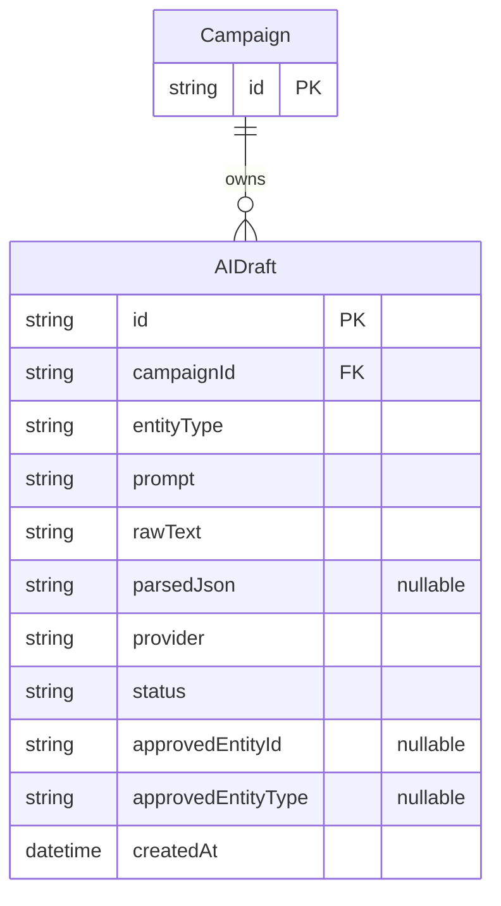

# SA_BLUEPRINT — AI DM Assistant (Sprint 7)

> Module base dir: `docs/modules/ai-dm/`. Reads: [PRD.md](./PRD.md) · [ARCHITECTURE.md](../../program/ARCHITECTURE.md) · [DATA_MODEL.md](../../program/DATA_MODEL.md).
> Stack constraints (LOCKED): Next.js 16 App Router, React 19, Tailwind v4 CSS-first, SQLite + Prisma 6, Socket.io 4.8, Vitest. Additive migrations only — no DROP/ALTER on existing tables.

---

## 1. ER diagram (additive)



Only `AIDraft` is new. No existing table is modified.

---

## 2. Prisma model

```prisma
// Sprint 7 — additive addition to prisma/schema.prisma

model AIDraft {
  id                  String    @id @default(cuid())
  campaignId          String
  campaign            Campaign  @relation(fields: [campaignId], references: [id], onDelete: Cascade)
  entityType          String    // "npc" | "loot" | "quest" | "session_recap"
  prompt              String
  rawText             String
  parsedJson          String?
  provider            String    // "ollama" | "import"
  status              String    @default("pending") // "pending" | "approved" | "rejected"
  approvedEntityId    String?
  approvedEntityType  String?
  createdAt           DateTime  @default(now())

  @@index([campaignId, status])
  @@index([campaignId, createdAt])
}
```

**Back-relation on Campaign** (additive, no migration SQL):
```prisma
// add to model Campaign:
aiDrafts  AIDraft[]
```

### Migration SQL sketch (migration name: `ai_dm`)

```sql
-- CreateTable
CREATE TABLE "AIDraft" (
  "id"                 TEXT NOT NULL PRIMARY KEY,
  "campaignId"         TEXT NOT NULL,
  "entityType"         TEXT NOT NULL,
  "prompt"             TEXT NOT NULL,
  "rawText"            TEXT NOT NULL,
  "parsedJson"         TEXT,
  "provider"           TEXT NOT NULL,
  "status"             TEXT NOT NULL DEFAULT 'pending',
  "approvedEntityId"   TEXT,
  "approvedEntityType" TEXT,
  "createdAt"          DATETIME NOT NULL DEFAULT CURRENT_TIMESTAMP,
  CONSTRAINT "AIDraft_campaignId_fkey"
    FOREIGN KEY ("campaignId") REFERENCES "Campaign" ("id") ON DELETE CASCADE ON UPDATE CASCADE
);
CREATE INDEX "AIDraft_campaignId_status_idx" ON "AIDraft"("campaignId","status");
CREATE INDEX "AIDraft_campaignId_createdAt_idx" ON "AIDraft"("campaignId","createdAt");
```

**Verified additive:** zero DROP, zero ALTER, zero destructive change to Sprints 0–6 tables.

---

## 3. `lib/ai/` module layout

```
lib/
  ai/
    types.ts       — AIDraftView, CreateDraftInput, ApproveDraftInput, GenerateInput, ImportInput, AIDraftResult
    rules.ts       — pure: validatePrompt, validateImportContent, validateEntityType, isValidStatus, parseLootDraft
    templates.ts   — prompt template functions: buildNpcPrompt, buildLootPrompt, buildQuestPrompt, buildRecapPrompt
    repo.ts        — Prisma CRUD: createDraft, getDraft, listPendingDrafts, updateDraft, softDeleteDraft
    service.ts     — orchestrate: generateDraft (resolve provider → call → save), importDraft, approveDraft, rejectDraft
    ollama.ts      — OllamaProvider: implements LLMProvider; generate() calls Ollama REST; isAvailable() pings /api/tags
    import.ts      — ImportProvider: implements LLMProvider; generate() wraps the pasted text, no network call
```

### `lib/ai/types.ts` (key shapes)

```typescript
export type AIDraftEntityType = "npc" | "loot" | "quest" | "session_recap";
export type AIDraftStatus = "pending" | "approved" | "rejected";
export type AIProvider = "ollama" | "import";

export interface AIDraftView {
  id: string;
  entityType: AIDraftEntityType;
  prompt: string;
  rawText: string;
  parsedJson: unknown | null;   // typed per entityType at runtime
  provider: AIProvider;
  status: AIDraftStatus;
  approvedEntityId: string | null;
  createdAt: string;
}

export interface GenerateInput {
  campaignId: string;
  entityType: AIDraftEntityType;
  prompt: string;
  context?: {
    cr?: number;
    sessionId?: string;
  };
}

export interface ImportInput {
  campaignId: string;
  entityType: AIDraftEntityType;
  content: string;
}
```

### `lib/ai/rules.ts` (pure functions — no DB, no LLM)

```typescript
export const PROMPT_MAX = 2000;
export const IMPORT_MAX = 10000;
export const ENTITY_TYPES: AIDraftEntityType[] = ["npc", "loot", "quest", "session_recap"];

export function validatePrompt(p: string): string | null   // null = ok, string = error
export function validateImportContent(c: string): string | null
export function validateEntityType(t: string): t is AIDraftEntityType
export function parseLootDraft(raw: string, cr: number): LootItem[]
  // deterministic: picks items from the SRD Item table by CR tier; calls crToXp for tier bracket
```

### `lib/ai/templates.ts` (prompt builders)

```typescript
export function buildNpcPrompt(prompt: string, campaignName?: string): string
export function buildLootPrompt(prompt: string, cr: number, itemPool: string[]): string
export function buildQuestPrompt(prompt: string, lastSessionRecap?: string): string
export function buildRecapPrompt(sessionDate: string, encounterNames: string[], prompt: string): string
```

Each template:
1. Sets a tight system prompt instructing the model to return **only JSON** in a defined schema.
2. Injects the DM's prompt and optional context.
3. Never asks the model to compute dice, AC, spell slots, or any rules math.

### `lib/ai/ollama.ts`

```typescript
export class OllamaProvider implements LLMProvider {
  readonly id = "ollama";
  private model: string;  // from OLLAMA_MODEL env, default "qwen2.5:14b"

  async isAvailable(): Promise<boolean>
    // GET http://localhost:11434/api/tags → 200 = true; timeout 2s → false
  async generate(prompt: string, opts?: LLMOptions): Promise<string>
    // POST http://localhost:11434/api/generate {model, prompt, system, stream: false}
    // throws ProviderError on non-200 or timeout
}
```

### `lib/ai/import.ts`

```typescript
export class ImportProvider implements LLMProvider {
  readonly id = "import";
  async isAvailable(): Promise<boolean> { return true; }
  async generate(prompt: string): Promise<string>
    // wraps the pasted content as-is (no network call); does a simple JSON detection heuristic
}
```

### `lib/ai/service.ts` (orchestrator)

```typescript
export async function generateDraft(input: GenerateInput, session: PlayerSession): Promise<AIDraftView>
  // 1. role === "dm" check (throws 403)
  // 2. validatePrompt
  // 3. resolve active provider (getLLMProvider()); throw 503 if none / unavailable
  // 4. buildPrompt(input.entityType, input.prompt, input.context)
  // 5. provider.generate(prompt, {json:true, maxTokens:1500})
  // 6. tryParseJson(raw) → parsedJson or null
  // 7. repo.createDraft(…)
  // 8. return AIDraftView

export async function importDraft(input: ImportInput, session: PlayerSession): Promise<AIDraftView>
  // role check → validateImportContent → ImportProvider.generate → parse → repo.createDraft

export async function approveDraft(draftId: string, session: PlayerSession): Promise<AIDraftView>
  // role check → getDraft → verify campaignId match (403 cross-campaign)
  // → entityType handler:
  //     "npc"          → storyRepo.createNpc(parsedJson fields, campaignId)
  //     "quest"        → storyRepo.createQuest(parsedJson fields, campaignId)
  //     "session_recap"→ storyRepo.patchSession(sessionId, {recap: rawText})
  //     "loot"         → (display only; no entity created; status → "approved")
  // → updateDraft(status:"approved", approvedEntityId)

export async function rejectDraft(draftId: string, session: PlayerSession): Promise<void>
  // role check → updateDraft(status:"rejected")

export async function listDrafts(campaignId: string, session: PlayerSession): Promise<AIDraftView[]>
export async function getProviderStatus(): Promise<{ollama:boolean, import:boolean}>
```

---

## 4. REST endpoints

All routes live under `app/api/ai/`. All `force-dynamic`. All DM-only (403 for players).

| File | Method | Status codes | Notes |
|------|--------|-------------|-------|
| `app/api/ai/generate/route.ts` | POST | 201 · 401 · 403 · 422 · 502 · 503 | 503 when no provider; 502 on provider error (edge 5.2) |
| `app/api/ai/import/route.ts` | POST | 201 · 401 · 403 · 422 | Always available |
| `app/api/ai/drafts/route.ts` | GET | 200 · 401 · 403 | Returns `AIDraftView[]` pending drafts |
| `app/api/ai/drafts/[id]/route.ts` | PATCH · DELETE | 200 · 401 · 403 · 404 · 422 | PATCH = approve or edit; DELETE = reject |
| `app/api/ai/status/route.ts` | GET | 200 · 401 | Provider health check; no role gate needed |

### Request / response shapes

**POST /api/ai/generate**
```json
// request
{ "entityType": "npc", "prompt": "...", "context": {"cr": 5} }
// response 201
{ "draft": AIDraftView }
// response 422
{ "error": "prompt_required" | "invalid_entity_type" | "no_active_session" }
// response 502
{ "error": "provider_error", "message": "..." }
// response 503
{ "error": "provider_unavailable" }
```

**PATCH /api/ai/drafts/[id]** (approve)
```json
// request
{ "action": "approve" }
// response 200
{ "draft": AIDraftView, "createdEntityId": string | null }
```

**GET /api/ai/status**
```json
// response 200
{ "ollama": true | false, "import": true }
```

---

## 5. Provider wiring

In `server/index.ts` (or wherever the Node server starts), after confirming Ollama is available at startup, call:

```typescript
import { OllamaProvider } from "@/lib/ai/ollama";
import { setLLMProvider } from "@/lib/llm/registry";

if (process.env.NODE_ENV !== "test") {
  const ollama = new OllamaProvider();
  ollama.isAvailable().then((ok) => {
    if (ok) setLLMProvider(ollama);
    else console.warn("[AI] Ollama not available — AI features disabled");
  });
}
```

The `ImportProvider` is always available but is used directly in `importDraft()` (not set as the global provider — it has no `generate()` backing LLM).

---

## 6. PRD §5 edge → handler traceability

| Edge | Handler |
|------|---------|
| 5.1 Ollama not running | `OllamaProvider.isAvailable()` → false → service throws 503 `provider_unavailable` |
| 5.2 Ollama error/timeout | `generate()` throws `ProviderError` → route catches → 502 |
| 5.3 Unparseable output | `tryParseJson(raw)` → null → `parsedJson=null`; draft saved with `rawText`; UI shows "edit manually" |
| 5.4 Empty prompt | `validatePrompt("")` → error → 422 `prompt_required`; client disables button too |
| 5.5 NPC limit on approve | `storyRepo.countNpcs(campaignId) >= NPC_LIMIT` → 422 `limit_reached` |
| 5.6 Quest limit on approve | `storyRepo.countQuests(campaignId) >= QUEST_LIMIT` → 422 `limit_reached` |
| 5.7 Reject draft | `updateDraft(status:"rejected")` → removed from pending list; still in DB |
| 5.8 Orphan FK after entity delete | No cascade on `approvedEntityId`; acceptable stale ref |
| 5.9 Player calls `/api/ai/*` | `resolveSession` → `role !== "dm"` → 403 |
| 5.10 Concurrent DM tabs | Each draft is independent; no lock needed |
| 5.11 Empty import | `validateImportContent("")` → 422 `content_required` |
| 5.12 Import too long | `content.length > IMPORT_MAX` → 422 `content_too_long` |
| 5.13 Edit after approve | Approved drafts have `status:"approved"`; UI hides edit form; no route for it |
| 5.14 No active session for recap | `service.generateDraft` checks `context.sessionId`; throws 422 `no_active_session` if missing |

---

## 7. Planned automated tests (~65 tests)

| File | Coverage |
|------|---------|
| `tests/ai-rules.test.ts` | validatePrompt (empty/too-long/ok), validateImportContent, validateEntityType, parseLootDraft (CR tiers), isValidStatus |
| `tests/ai-templates.test.ts` | buildNpcPrompt/buildLootPrompt/buildQuestPrompt/buildRecapPrompt output shape (contain expected keys, no code slips through) |
| `tests/ai-service.test.ts` | generateDraft authz (403 player), no-provider 503, provider-error 502, parsedJson null on bad response, approveDraft (npc/quest/loot/recap paths), rejectDraft, cross-campaign 403, listDrafts scoped |
| `tests/ai-routes.test.ts` | 401 no-session, 403 player, 422 validations, 201 success, 502/503 forwarding, PATCH approve, DELETE reject |

Total: ~65 new + 512 prior = ~577 tests.

---

## 8. DoD → evidence traceability

| DoD | Evidence |
|-----|---------|
| 1. AIDraft migration additive | `prisma migrate status` shows only `CREATE TABLE AIDraft`; no DROP/ALTER |
| 2. OllamaProvider isAvailable() | `tests/ai-rules.test.ts` mocked + live Ollama integration note |
| 3. ImportProvider no network | `tests/ai-service.test.ts` imports work with Ollama disabled |
| 4. Routes enforce DM-only | 403 tests in `ai-routes.test.ts` |
| 5. Approve NPC/Quest → entity created | `tests/ai-service.test.ts` approveDraft npc/quest paths |
| 6. UI panel DM-only; graceful Ollama-off | UXUI_DESIGN + live preview verify |
| 7. 512 prior tests remain green | Full `npm test` run at end of Stage 7 |
| 8. TEST_CASES.md written | Stage 8 output |
