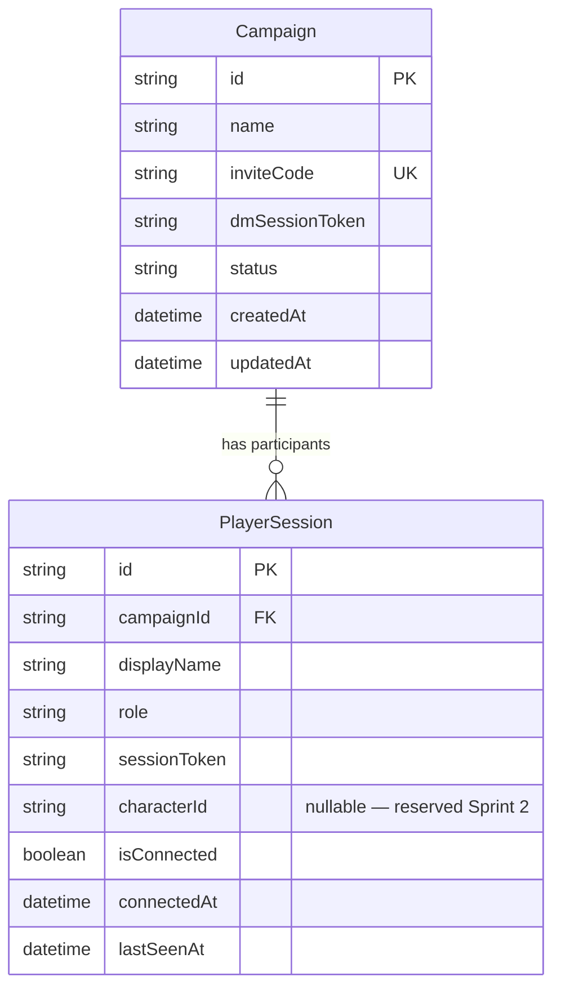

# SA_BLUEPRINT — Foundation (Sprint 0)
### D&D Campaign Manager · module 1 of 8

> Input: [PRD.md](./PRD.md). Hard constraints: [ARCHITECTURE](../../program/ARCHITECTURE.md) · [DATA_MODEL](../../program/DATA_MODEL.md) · [DESIGN_SYSTEM](../../program/DESIGN_SYSTEM.md).
> Owns entities: `Campaign`, `PlayerSession`. Downstream: `/uxui` → `/proto` → `/dev`.

---

## 1. ER Diagram



Relationship: `Campaign` 1—N `PlayerSession` (cascade delete sessions with the campaign). `PlayerSession.characterId` is a **nullable FK reserved for Sprint 2** — no `Character` table exists yet, so it stays a plain nullable string column until Characters lands and adds the relation via additive migration.

---

## 2. Database Schema Definition

### 2.1 Prisma schema (`/prisma/schema.prisma`)
```prisma
datasource db {
  provider = "sqlite"
  url      = env("DATABASE_URL") // file:./dev.db
}

generator client {
  provider = "prisma-client-js"
}

model Campaign {
  id             String          @id @default(cuid())
  name           String
  inviteCode     String          @unique
  dmSessionToken String          // secret; DM reconnect identity — never broadcast
  status         String          @default("active") // "active" | "closed"
  createdAt      DateTime        @default(now())
  updatedAt      DateTime        @updatedAt
  sessions       PlayerSession[]

  @@index([inviteCode])
}

model PlayerSession {
  id           String   @id @default(cuid())
  campaignId   String
  campaign     Campaign @relation(fields: [campaignId], references: [id], onDelete: Cascade)
  displayName  String
  role         String   // "dm" | "player"
  sessionToken String   // secret; reconnect identity — never broadcast
  characterId  String?  // RESERVED Sprint 2 (Characters); nullable, no FK relation yet
  isConnected  Boolean  @default(true)
  connectedAt  DateTime @default(now())
  lastSeenAt   DateTime @default(now())

  @@unique([campaignId, displayName]) // names unique WITHIN a campaign, not globally
  @@index([campaignId])
}
```

### 2.2 Column reference
| Entity.Field | Type | Constraints | Description |
|---|---|---|---|
| Campaign.id | String | PK, cuid | tenant root id |
| Campaign.name | String | 1–60 chars (app-validated) | display name |
| Campaign.inviteCode | String | **UNIQUE**, indexed | short readable join code |
| Campaign.dmSessionToken | String | secret | DM reconnect identity; never in broadcasts |
| Campaign.status | String | default `active` | `active`/`closed` |
| PlayerSession.id | String | PK, cuid | |
| PlayerSession.campaignId | String | FK→Campaign, **cascade**, indexed | tenancy scope |
| PlayerSession.displayName | String | 1–24 chars; **unique per campaignId** | shown in roster |
| PlayerSession.role | String | `dm`/`player` | authz axis |
| PlayerSession.sessionToken | String | secret | reconnect identity; never broadcast |
| PlayerSession.characterId | String? | nullable, **reserved Sprint 2** | will become FK→Character |
| PlayerSession.isConnected | Boolean | default true | live presence for roster |
| PlayerSession.connectedAt / lastSeenAt | DateTime | | presence/heartbeat |

> **SQLite note:** no native enums — `status`/`role` are strings validated in app code (Zod). Booleans are stored as integers by SQLite; Prisma maps them.

### 2.3 Migration plan — Sprint 0 baseline
- `npx prisma migrate dev --name foundation_baseline` → creates `Campaign` + `PlayerSession`.
- This is **migration #1**; all future schema changes are **additive migrations** (e.g. Sprint 2 turns `characterId` into a real FK relation; Sprint 4 adds `conditions` to Character — never to these two tables destructively).
- Seed: none required for Foundation (reference-data seed arrives Sprint 1).

---

## 3. Socket.io Event Contract

All live mutations are **intents** (`domain:action`), client→server. The server **validates → persists → broadcasts** to the `campaignId` room only. Every payload implicitly carries the socket's authenticated identity (token), from which the server derives `campaignId` + `role` — **never trust client-claimed role/campaign**.

### 3.1 Connection & auth handshake
- Client connects with `auth: { sessionToken }` (or none, for pre-join landing).
- Server resolves the token → `{ campaignId, sessionId, role }`, joins the socket to room `campaign:{campaignId}`. Unknown/absent token → socket stays "lobby-less" until a `campaign:create`/`campaign:join` intent.

### 3.2 Intents (client → server)
| Intent | Payload | Server validation | On success → broadcast |
|---|---|---|---|
| `campaign:create` | `{ campaignName, dmDisplayName }` | shape valid; generate unique invite code | reply `state:snapshot` to creator (+ issues `dmSessionToken`); socket joins room |
| `campaign:join` | `{ inviteCode, displayName }` | code exists & `status=active`; name unused in campaign | reply `state:snapshot` to joiner (+ issues `sessionToken`); `roster:update` to room |
| `campaign:rename` | `{ name }` | **role=dm** for this campaign; 1–60 chars | `state:patch` (campaign.name) to room |
| `participant:remove` | `{ sessionId }` | **role=dm**; target belongs to same campaign; DM can't remove self | `roster:update` to room; targeted `session:kicked` to the removed socket |
| `session:resume` | `{ sessionToken }` (in handshake) | token matches a session/DM in a campaign | reply `state:snapshot`; mark `isConnected=true`; `roster:update` to room |
| `session:leave` | `{}` | valid session | mark `isConnected=false`; `roster:update` to room |
| *(implicit)* `disconnect` | — | socket drops | mark `isConnected=false`, set `lastSeenAt`; `roster:update` to room |

### 3.3 Broadcasts (server → client)
| Event | Shape | Meaning |
|---|---|---|
| `state:snapshot` | full `CampaignState` (see §3.4) + the caller's issued token | sent on create/join/resume — the authoritative starting truth |
| `roster:update` | `{ participants: ParticipantView[] }` | roster changed (join/leave/remove/presence) |
| `state:patch` | `{ path, value }` (e.g. campaign name) | small authoritative delta |
| `session:kicked` | `{ reason }` | this client was removed by the DM |
| `error` | `{ code, message }` | typed rejection (bad code, dup name, unauthorized, malformed) |

### 3.4 Shared state snapshot shape
```ts
// Broadcast to clients — NEVER includes secret tokens.
interface ParticipantView {
  sessionId: string;
  displayName: string;
  role: "dm" | "player";
  isConnected: boolean;
  characterId: string | null; // always null in Foundation
}
interface CampaignState {
  campaignId: string;
  name: string;
  status: "active" | "closed";
  inviteCode: string;            // visible to all participants (it's how the table joins)
  participants: ParticipantView[];
}
// The issued secret token is delivered to its owner ONLY, alongside the snapshot,
// never inside CampaignState/ParticipantView.
```

---

## 4. Server-Authoritative State Store

### 4.1 In-memory working set
```ts
// Keyed by campaignId. The live, authoritative truth during play.
type WorkingSet = Map<string /*campaignId*/, {
  state: CampaignState;                 // broadcastable view
  secrets: { dmSessionToken: string; bySession: Map<string, string> };
  sockets: Map<string /*sessionId*/, Set<string /*socketId*/>>; // multi-tab presence
}>;
```
- The **in-memory set is the live truth**; **SQLite is the durable truth**. Writes go **memory → DB (same tick) → broadcast**.
- Presence (`isConnected`) is derived from `sockets`: connected while ≥1 socket is live for that session (handles the two-tabs case 5.12).

### 4.2 Persistence
- Every successful intent persists via Prisma **before** broadcasting (so a crash can't broadcast a state the DB never saw).
- `lastSeenAt`/`isConnected` updated on connect/disconnect.

### 4.3 Rehydrate-on-boot (server restart — edge 5.9)
1. On startup, load all `active` campaigns + their `PlayerSession`s from SQLite.
2. Rebuild each `WorkingSet` entry; mark **all participants `isConnected=false`** (no live sockets yet).
3. As clients reconnect with their token (`session:resume`), flip presence and emit `roster:update`.

### 4.4 Snapshot-on-reconnect (edge 5.4–5.6)
- Client reconnects → handshake `sessionToken` → server matches it (DM token or a `PlayerSession.sessionToken`) → returns full `state:snapshot`, flips `isConnected=true`, broadcasts `roster:update`. **No duplicate seat** — identity is the token, not the name.

---

## 5. Invite Codes & Session Tokens

### 5.1 Invite code
- **Alphabet:** `ABCDEFGHJKMNPQRSTUVWXYZ23456789` (no `0/O/1/I/L`) — readable aloud across a table.
- **Format:** 6 chars (e.g. `K7Q-M2P` rendered with a dash; stored without). ~33⁶ space, ample for a home server.
- **Generation:** random → check `@unique` → retry on the rare collision (edge 5.7).

### 5.2 Session tokens
- `dmSessionToken` (per campaign) and per-player `sessionToken`: cryptographically random (e.g. `crypto.randomUUID()` ×2 or 32-byte base64url).
- **Reconnect identity** only — there's no password. Stored client-side (localStorage) and sent in the Socket.io handshake.
- **Secrets never appear in any broadcast** — only delivered to their owner alongside their own snapshot. The roster broadcast uses `sessionId`, not tokens.
- LAN-trust model: anyone with the invite code on the Wi-Fi can join (documented, acceptable for v1).

---

## 6. LLMProvider Stub (no AI yet)

```ts
// /lib/llm/provider.ts
export interface LLMProvider {
  readonly id: string;                      // e.g. "ollama" | "claude" | "import"
  generate(prompt: string, opts?: LLMOptions): Promise<string>;
  isAvailable(): Promise<boolean>;
}
export interface LLMOptions { system?: string; maxTokens?: number; json?: boolean }

// /lib/llm/registry.ts
let active: LLMProvider | null = null;       // DEFAULT: none — no adapter shipped in Sprint 0
export function getLLMProvider(): LLMProvider | null { return active; }
export function setLLMProvider(p: LLMProvider | null) { active = p; }
export async function isLLMEnabled(): Promise<boolean> {
  return !!active && (await active.isAvailable());
}
```
- **Default resolves to `null`** → `isLLMEnabled()` is false → all AI-dependent UI is simply absent. Nothing in Foundation calls an LLM.
- Sprint 7 registers an `OllamaProvider` / import path via `setLLMProvider` — **no call-site refactor**.
- Rule preserved from ARCHITECTURE: LLM calls (when they exist) run **server-side only**, never the browser.

---

## 7. Module Layout & Process Wiring

### 7.1 Folders (within the locked repo layout)
```
/app
  /(lobby)
    page.tsx                 landing: Create / Join
    create/page.tsx          DM create form
    join/page.tsx            player join form
    campaign/[id]/page.tsx   lobby (DM + player views)
  /api
    health/route.ts          GET health (non-realtime)
/server
  index.ts                   custom Node server: Next + Socket.io on one process
  io.ts                      Socket.io setup, room + handshake auth
  handlers/
    campaign.ts              create / join / rename / remove intents
    session.ts               resume / leave / disconnect
  state/
    workingSet.ts            in-memory authoritative store (§4)
    persist.ts               Prisma read/write + rehydrate-on-boot
/lib
  inviteCode.ts              generation + collision retry
  tokens.ts                  token generation
  validation.ts              Zod schemas for every intent payload
  llm/{provider.ts,registry.ts}   LLMProvider stub (§6)
/prisma
  schema.prisma
  migrations/                foundation_baseline
```

### 7.2 Single-process wiring (Next + Socket.io)
- A **custom server** (`/server/index.ts`) creates the Next.js request handler **and** attaches a Socket.io server to the **same HTTP server**, listening on `0.0.0.0:3000`. One Node process serves the UI and the realtime layer (per ARCHITECTURE — single LAN host).
- `npm run dev` runs this custom server (not `next dev` directly) so sockets are available in dev.
- Next's App Router renders the UI; **all live mutations go through Socket.io**, not API routes.

### 7.3 API/route surface
| Surface | Use | Examples |
|---|---|---|
| **Socket.io intents** | every live mutation + sync (state must broadcast) | `campaign:create/join/rename`, `participant:remove`, `session:resume/leave` |
| **Next route handlers (REST)** | non-realtime/read-only only | `GET /api/health`; later modules: reference-data reads, prep-time CRUD, server-side LLM calls |

---

## 8. Security & Authentication
- **No passwords** (v1). Identity = possession of a session token (reconnect) + invite code (join). LAN-trust model, documented.
- **Authorization server-side on every intent:** role + ownership + campaign-scope re-derived from the token, never from payload (edge 5.10).
- **Tenancy isolation:** every query filtered by `campaignId`; every broadcast scoped to `campaign:{id}` room — no cross-campaign leakage.
- **Secrets hygiene:** tokens never broadcast; only `sessionId`/`displayName`/presence in roster.
- **Input validation:** Zod-validate every intent payload; reject malformed/oversized without crashing the room (edge 5.11).

## 9. Technical Notes & Best Practices
- Persist-before-broadcast ordering guarantees the DB never lags a broadcast.
- Keep the `CampaignState` broadcast lean; use `state:patch` for small deltas, `state:snapshot` only on (re)connect.
- Index `inviteCode` (lookups on join) and `campaignId` (roster queries).
- Graceful shutdown: flush nothing extra needed (writes are synchronous-per-intent), but on boot always rehydrate `active` campaigns.

## 10. Out of scope (deferred — do not build here)
5e character sheet (Sprint 2, will activate `characterId` FK) · combat/conditions (4) · reference data (1) · story (5) · dice (6) · **real AI generation** (7 — only the stub ships now).

---

*Next stage: `/uxui` reads PRD + this blueprint + the program DESIGN_SYSTEM → writes `docs/modules/foundation/UXUI_DESIGN.md` (landing, create, join, lobby screens) inheriting the locked tokens.*
