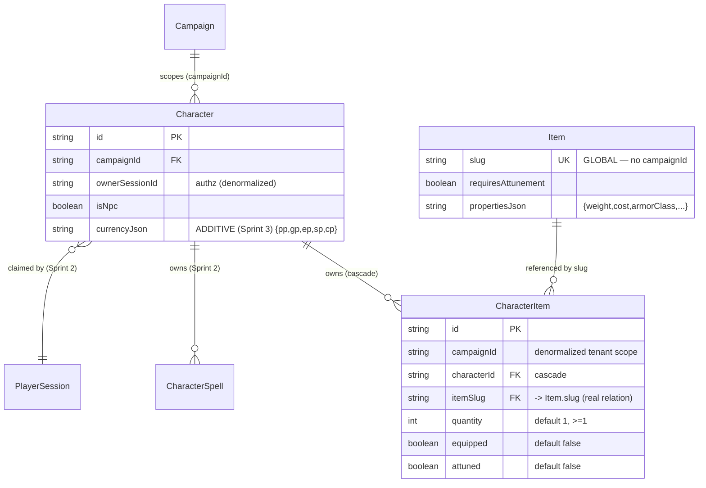

# SA_BLUEPRINT — Inventory (Sprint 3)
### D&D Campaign Manager · module 4 of 8 · `/sa` (Stage 2)

> Input: [PRD](./PRD.md). Hard constraints: [ARCHITECTURE](../../program/ARCHITECTURE.md), [DATA_MODEL](../../program/DATA_MODEL.md) (`#character`, `#item`, `#characteritem`).
> **As-built pattern ที่ mirror:** Sprint 2 `CharacterSpell` (join + denormalized `campaignId` + real relation by slug) และ `lib/characters/{auth,service,charRepo,refRepo}.ts`. Inventory = **prep-time CRUD ผ่าน REST** (ไม่ใช่ Socket.io), additive ทั้งหมด.

---

## 1. ER Diagram



> หมายเหตุ: `CharacterItem.itemSlug` ชี้ `Item.slug` (GLOBAL, ไม่มี `campaignId`) — เหมือน `CharacterSpell.spellSlug → Spell.slug`. Item เป็น reference อ่านอย่างเดียว ลบไม่ได้ตอนถูกอ้าง (Prisma default Restrict) — ปลอดภัยเพราะ seed ใช้ upsert by slug ไม่ลบ.

---

## 2. Database Schema Definition

### 2.1 `CharacterItem` (ใหม่ — Inventory เป็นเจ้าของ)
| Column | Type | Constraints | Description |
|--------|------|-------------|-------------|
| `id` | String | PK, cuid | |
| `campaignId` | String | **denormalized**, (ไม่มี FK แยก — ตาม pattern `CharacterSpell`) | tenant scope; ทุก query `where:{campaignId}` |
| `characterId` | String | FK→`Character.id`, **onDelete: Cascade**, indexed | เจ้าของไอเทม |
| `itemSlug` | String | **real relation → `Item.slug`** | soft key เสถียรข้าม reseed |
| `quantity` | Int | `@default(1)`, app-validate ≥ 1 | จำนวน stack |
| `equipped` | Boolean | `@default(false)` | สวมใส่อยู่ |
| `attuned` | Boolean | `@default(false)` | ผูกพลังอยู่ (กติกา cap 3) |
| | | **`@@unique([characterId, itemSlug])`** | 1 แถว/ไอเทม/ตัวละคร → stack ด้วย quantity |
| | | **`@@index([characterId])`** | list per character เร็ว |

**Prisma model (ที่จะเพิ่มใน `schema.prisma`):**
```prisma
model CharacterItem {
  id          String    @id @default(cuid())
  campaignId  String // denormalized for tenant-scoped queries (mirror CharacterSpell)
  characterId String
  character   Character @relation(fields: [characterId], references: [id], onDelete: Cascade)
  itemSlug    String // FK -> Item.slug (stable across reseed)
  item        Item      @relation(fields: [itemSlug], references: [slug])
  quantity    Int       @default(1)
  equipped    Boolean   @default(false)
  attuned     Boolean   @default(false)

  @@unique([characterId, itemSlug])
  @@index([characterId])
}
```

**Back-relations (เพิ่มในโมเดลเดิม — additive, ไม่เปลี่ยนคอลัมน์):**
```prisma
// ใน model Character:
items     CharacterItem[]
// ใน model Item:
characterItems CharacterItem[]
```

### 2.2 `Character.currency` — additive column
```prisma
// ใน model Character (เพิ่มบรรทัดเดียว):
currencyJson String @default("{}") // JSON: { pp, gp, ep, sp, cp } — Inventory (Sprint 3)
```

**ตัดสิน: JSON column เดียว (`currencyJson`)** ✅
| ตัวเลือก | Pros | Cons | ตัดสิน |
|----------|------|------|--------|
| **A. `currencyJson` (1 JSON col)** | ตรงกับ convention ทั้งโปรเจกต์ (savesJson/spellSlotsJson/…); additive ง่าย default `"{}"`; เพิ่ม/ลดสกุลในอนาคตไม่ต้อง migrate | ต้อง parse; ไม่ query ผลรวมเงินด้วย SQL ได้ตรง ๆ (ไม่จำเป็นใน v1) | ✅ **เลือก** |
| B. 5 Int columns (`pp,gp,ep,sp,cp`) | query/aggregate ด้วย SQL ได้ | 5 ALTER, schema บวม, ไม่เข้ากับ pattern JSON ที่ใช้ทุกที่ | ❌ |

> ค่า default ตอนอ่าน: `parseJson(currencyJson, {pp:0,gp:0,ep:0,sp:0,cp:0})` — ทุกสกุล ≥ 0.

### 2.3 Migration `inventory` (additive only)
SQL sketch (Prisma จะ generate; ยืนยันว่า **ไม่มี DROP/รื้อ**):
```sql
-- CREATE ใหม่
CREATE TABLE "CharacterItem" (
  "id"          TEXT NOT NULL PRIMARY KEY,
  "campaignId"  TEXT NOT NULL,
  "characterId" TEXT NOT NULL,
  "itemSlug"    TEXT NOT NULL,
  "quantity"    INTEGER NOT NULL DEFAULT 1,
  "equipped"    BOOLEAN NOT NULL DEFAULT false,
  "attuned"     BOOLEAN NOT NULL DEFAULT false,
  CONSTRAINT "CharacterItem_characterId_fkey"
    FOREIGN KEY ("characterId") REFERENCES "Character"("id") ON DELETE CASCADE ON UPDATE CASCADE,
  CONSTRAINT "CharacterItem_itemSlug_fkey"
    FOREIGN KEY ("itemSlug") REFERENCES "Item"("slug") ON DELETE RESTRICT ON UPDATE CASCADE
);
CREATE UNIQUE INDEX "CharacterItem_characterId_itemSlug_key" ON "CharacterItem"("characterId","itemSlug");
CREATE INDEX "CharacterItem_characterId_idx" ON "CharacterItem"("characterId");

-- ALTER เดิม (additive, มี default → row เดิมปลอดภัย)
ALTER TABLE "Character" ADD COLUMN "currencyJson" TEXT NOT NULL DEFAULT '{}';
```
- `Item.slug @unique` มีอยู่แล้ว → relation ใช้ได้ทันที.
- `foundation_baseline`, `5e_reference`, `characters` migration **ไม่ถูกแตะ** → **regression gate** (DoD #2).

---

## 3. lib layout (`lib/inventory/`)

### 3.1 `rules.ts` — pure deterministic (no LLM, no DB)
```ts
export const ATTUNEMENT_CAP = 3;
export const CURRENCIES = ["pp","gp","ep","sp","cp"] as const;
export type Currency = Record<(typeof CURRENCIES)[number], number>;

isAttunable(item: { requiresAttunement: boolean }): boolean       // = item.requiresAttunement
validateQuantity(q: unknown): boolean                            // Number.isInteger(q) && q >= 1
validateCurrency(c: Partial<Currency>): boolean                  // ทุก key เป็น int ≥ 0
normalizeCurrency(c: Partial<Currency>): Currency                // เติม 0 ให้ครบ 5 สกุล
countAttuned(items: { attuned: boolean }[]): number              // นับ attuned=true
canAttuneMore(items, ATTUNEMENT_CAP): boolean                    // countAttuned < cap
```
> ทดสอบเทียบกติกา 5e เป็น unit (vitest) — เหมือน `lib/characters/rules.ts`.

### 3.2 `types.ts`
`InventoryItemView` (id, itemSlug, name, type, rarity, requiresAttunement, weight?, cost?, quantity, equipped, attuned, missingRef?), `InventoryView` (items: InventoryItemView[], attunedCount, attunementCap, currency: Currency), `AddItemInput` ({itemSlug, quantity?}), `UpdateItemInput` ({equipped?, attuned?, quantity?}), `SetCurrencyInput` (Partial<Currency>).

### 3.3 `repo.ts` — tenant-scoped persistence (ทุก query `where:{campaignId}`)
```ts
listItems(campaignId, characterId): CharacterItem[]
findItem(campaignId, characterId, characterItemId): CharacterItem | null
upsertItem(campaignId, characterId, itemSlug, quantity)   // @@unique → increment quantity ถ้ามี (edge 5.13)
updateItem(campaignId, characterItemId, patch)            // equipped/attuned/quantity
removeItem(campaignId, characterItemId): void
getCurrencyRaw(campaignId, characterId): string           // Character.currencyJson
setCurrency(campaignId, characterId, currencyJson): void
countAttunedInDb(campaignId, characterId): number         // สำหรับ cap check ใน tx (edge 5.11)
```
> ใช้ `prisma.$transaction` ใน `service.attune` (ดู §3.4). Repo ไม่ตัดสิน authz/กติกา — แค่ persistence scope.

### 3.4 `service.ts` — authz + กติกา + view
- **reuse** `canWrite(session, character)` จาก `lib/characters/service.ts` (player = own only; DM = any in same campaign) — **ไม่ duplicate** logic.
- `loadCharacter(campaignId, characterId)` → ถ้าไม่อยู่ในแคมเปญ → null (→ 404).
- `addItem(session, character, input)`:
  1. `canWrite` ไม่ผ่าน → throw 403.
  2. `validateQuantity` ไม่ผ่าน → 422 `invalid_quantity`.
  3. resolve `itemSlug` ใน `Item` (ผ่าน `lib/reference` repo / `prisma.item.findUnique({where:{slug}})`) → ไม่พบ → 404 `not_found`.
  4. `repo.upsertItem` (increment ถ้า slug ซ้ำ).
- `setItemFields(session, character, characterItemId, patch)`:
  - **attune=true** → ทำใน **`prisma.$transaction`**: (a) โหลด CharacterItem + Item; ถ้า `!isAttunable` → 422 `not_attunable`; (b) `countAttunedInDb` (อ่านสดจาก DB) — ถ้า ≥ 3 และไอเทมนี้ยังไม่ attuned → 422 `attunement_limit`; (c) set attuned=true. **นับจาก DB ใน tx → กัน concurrent (edge 5.11)** ไม่เชื่อ count จาก client.
  - **attune=false / equip toggle / quantity** → validate (quantity → `validateQuantity`) แล้ว update. unequip/unattune idempotent (edge 5.12).
- `removeItem(session, character, characterItemId)` → canWrite → `repo.removeItem` (edge 5.6 empty ok; cascade เมื่อ char ถูกลบ = 5.14).
- `setCurrency(session, character, input)` → canWrite → `validateCurrency` (มีค่าติดลบ/ไม่ใช่ int → 422 `invalid_currency`) → `normalizeCurrency` → `repo.setCurrency(JSON.stringify(...))`.
- `toInventoryView(campaignId, characterId)` → join CharacterItem กับ Item (resolve name/type/rarity/requiresAttunement + weight/cost จาก `parseJson(propertiesJson)`); **slug หาย → `missingRef:true`, แสดง slug แทน, ไม่ crash (edge 5.15)**; รวม `attunedCount`/`cap`/`currency`.

---

## 4. API Contracts (REST route handlers, `export const dynamic = "force-dynamic"`)

ทุก handler: `resolveSession(req)` → ไม่มี → **401**; โหลด character ในแคมเปญ → ไม่อยู่ → **404**; `canWrite` ไม่ผ่าน → **403**; validate → **422**; สำเร็จ → **200/201**.

| Method | Endpoint | Body | Success | สอดคล้อง |
|--------|----------|------|---------|----------|
| GET | `/api/characters/[id]/items` | — | 200 `InventoryView` | list + counters |
| POST | `/api/characters/[id]/items` | `{itemSlug, quantity?}` | 201 `InventoryView` | US-1/5.3/5.13 |
| PATCH | `/api/characters/[id]/items/[itemId]` | `{equipped?, attuned?, quantity?}` | 200 `InventoryView` | US-3/4, 5.1/5.2/5.4/5.11/5.12 |
| DELETE | `/api/characters/[id]/items/[itemId]` | — | 200 `InventoryView` | US-5/5.6 |
| PATCH | `/api/characters/[id]/currency` | `{pp?,gp?,ep?,sp?,cp?}` | 200 `{currency}` | US-6/5.7 |

**Currency = endpoint เฉพาะ `/currency`** ✅ (ไม่ยัดใน character PATCH เดิม)
- เหตุผล: แยก concern (Inventory ไม่แตะ recompute/override logic ของ character update เดิม Sprint 2 → ลดความเสี่ยง regression), authz/validation ของ currency อยู่ใน `lib/inventory` ครบชุด, ทดสอบแยกง่าย. ทางเลือกยัดใน `PATCH /api/characters/[id]` ถูกตัดเพราะต้องแก้ service เดิม + เสี่ยง override path.

**Error body:** `{ error: "unauthorized" | "forbidden" | "not_found" | "not_attunable" | "attunement_limit" | "invalid_quantity" | "invalid_currency" }`.

---

## 5. Security & Authentication

### 5.1 Authz matrix (re-derived server-side จาก token; ไม่เชื่อ payload)
| Actor | เป้าหมาย | ผล |
|-------|----------|-----|
| Player | ตัวละครตัวเอง (`ownerSessionId == session.id`) | ✅ 200 |
| Player | ตัวละครคนอื่น (same campaign) | ❌ 403 |
| Player/DM | ตัวละครข้ามแคมเปญ | ❌ 404 (ไม่เผยตัวตน) |
| DM | ทุกตัวในแคมเปญตัวเอง (รวม NPC `ownerSessionId=null`) | ✅ 200 |
| ใครก็ตาม | ไม่มี/ token พัง | ❌ 401 |

- `resolveSession(req)` (reuse `lib/characters/auth.ts`): `Authorization: Bearer` / `x-session-token` → `prisma.playerSession.findFirst({where:{sessionToken}})`.
- `canWrite` (reuse `lib/characters/service.ts`): `session.role==="dm" && char.campaignId===session.campaignId` **||** `char.ownerSessionId===session.id`.
- การโหลด character ต้อง `where:{ id, campaignId: session.campaignId }` → cross-campaign กลายเป็น "ไม่พบ" → 404 (edge 5.10).

### 5.2 Multi-tenancy
ทุก repo query มี `campaignId`. `CharacterItem.campaignId` denormalized = scope ตรงโดยไม่ join Character ทุกครั้ง (เหมือน CharacterSpell).

### 5.3 Determinism
กติกา attunement/quantity/currency = code ใน `lib/inventory/rules.ts` + เช็ค cap ใน transaction. ไม่มี LLM.

---

## 6. Test Plan (vitest — mock Prisma + refRepo เหมือน Sprint 2)
| File | ครอบ |
|------|------|
| `tests/inventory-rules.test.ts` | `isAttunable`, `validateQuantity` (0/neg/float/≥1), `validateCurrency` (neg/float/ok), `normalizeCurrency` (เติม 0), `countAttuned`/`canAttuneMore` (cap boundary 2→3→4) |
| `tests/inventory-service.test.ts` | addItem (resolve slug → 404 / upsert stack 5.13), setItemFields: **attune non-attunable → 422 (5.1)**, **attune ชิ้นที่ 4 → 422 (5.2)**, **cap นับจาก DB ใน tx — concurrent (5.11)**, unattune idempotent (5.12), quantity≤0 → 422 (5.4), setCurrency neg → 422 (5.7), `canWrite` matrix (own/other 403/DM/cross-campaign 404), removeItem (5.6), toInventoryView missing slug → missingRef (5.15) |
| (มี ก็ดี) route smoke | status code 401/403/404/422 mapping |
> Mock: `vi.mock("@/lib/db")`, `vi.mock("@/lib/characters/service")` (canWrite) ตาม pattern `characters-service.test.ts`. `$transaction` mock ให้รัน callback ด้วย tx ที่ stub `countAttunedInDb`.

---

## 7. Traceability

### 7.1 PRD §5 edge → จัดการที่
| Edge | ที่จัดการ |
|------|-----------|
| 5.1 not_attunable | `service.setItemFields` attune branch + `isAttunable`; UI ซ่อนปุ่ม |
| 5.2 attunement_limit (4th) | `service` tx + `countAttunedInDb ≥ cap` |
| 5.3 add unknown slug → 404 | `service.addItem` resolve Item → null |
| 5.4 quantity ≤0 → 422 | `validateQuantity` ใน add/patch |
| 5.5 player other → 403 | `canWrite` |
| 5.6 remove last → empty | `repo.removeItem` + UI empty state |
| 5.7 currency neg → 422 | `validateCurrency` |
| 5.8 malformed item JSON | `parseJson` fallback ใน `toInventoryView` |
| 5.9 DM edits any | `canWrite` (dm branch) |
| 5.10 cross-campaign → 404 | load `where:{id,campaignId}` |
| 5.11 concurrent attune | cap check ใน `$transaction` อ่าน DB สด |
| 5.12 idempotent unequip/unattune | update set ตรง ๆ, no precondition error |
| 5.13 stack same slug | `repo.upsertItem` @@unique increment |
| 5.14 char delete cascade | FK `onDelete: Cascade` |
| 5.15 slug หาย graceful | `toInventoryView` `missingRef` |
| 5.16 no session → 401 | `resolveSession` null |

### 7.2 DoD → หลักฐาน
| DoD | ที่ทำให้ผ่าน |
|-----|--------------|
| 1 migration additive | §2.3 CREATE + ALTER เท่านั้น |
| 2 regression gate | ไม่แตะ migration เดิม; รัน full suite |
| 3 add SRD / 404 | §3.4 addItem, §4 POST |
| 4 quantity/equip | §3.1/§3.4 |
| 5 attunement rules | §3.4 attune tx + §3.1 |
| 6 currency 5 สกุล | §3.4 setCurrency, §4 PATCH /currency |
| 7 remove/cascade | §3.4 removeItem, §2.1 FK |
| 8 authz server-side | §5.1 matrix |
| 9 states | UXUI (Stage 4) |
| 10 DATA_MODEL amended | ทำใน step นี้ (ด้านล่าง) |
| 11 determinism+tests | §6 |

---

## 8. Technical Notes & Best Practices
- **Additive-only**: ห้าม edit migration เดิม; `prisma migrate dev --name inventory` สร้างไฟล์ใหม่; ตรวจ diff ว่ามีแค่ CREATE TABLE CharacterItem + ALTER ADD currencyJson.
- **Reuse ไม่ duplicate**: `auth.ts`, `canWrite`, `parseJson`, reference Item lookup — ใช้ของ Sprint 1/2.
- **เลข cap เป็นค่าคงที่** `ATTUNEMENT_CAP=3` ที่เดียวใน `rules.ts`.
- **`toInventoryView` graceful** กับ slug/JSON พัง — ไม่ทำให้หน้าทั้งหน้าล่ม.
- UI ฝังในหน้า `/characters` sheet เดิม (Stage 4) — inherit DESIGN_SYSTEM, ไม่เพิ่ม route หน้าใหม่.
