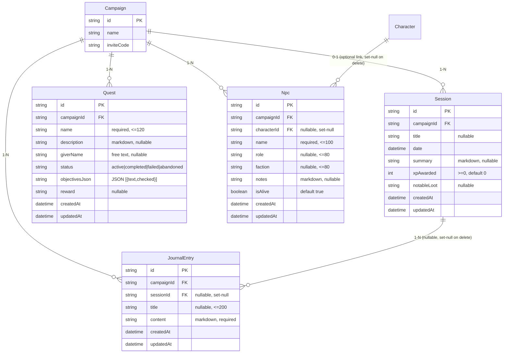

# SA Blueprint — Story Module (Sprint 5)
### D&D Campaign Manager · Sprint 5 · `/sa` output · 2026-06-21

Reads: `docs/modules/story/PRD.md`
Hard constraints: `docs/program/ARCHITECTURE.md` · `docs/program/DATA_MODEL.md` · `docs/program/DESIGN_SYSTEM.md`

---

## 1. ER Diagram



---

## 2. Database Schema

### 2.1 Prisma Models (additive — append to schema.prisma)

```prisma
model Session {
  id          String    @id @default(cuid())
  campaignId  String
  title       String?
  date        DateTime
  summary     String?
  xpAwarded   Int       @default(0)
  notableLoot String?
  createdAt   DateTime  @default(now())
  updatedAt   DateTime  @updatedAt

  campaign       Campaign       @relation(fields: [campaignId], references: [id], onDelete: Cascade)
  journalEntries JournalEntry[]

  @@index([campaignId])
  @@index([campaignId, date])  // list sorted by date desc
}

model Quest {
  id             String   @id @default(cuid())
  campaignId     String
  name           String
  description    String?
  giverName      String?
  status         String   @default("active")  // active|completed|failed|abandoned
  objectivesJson String   @default("[]")       // JSON: [{text:string, checked:boolean}]
  reward         String?
  createdAt      DateTime @default(now())
  updatedAt      DateTime @updatedAt

  campaign Campaign @relation(fields: [campaignId], references: [id], onDelete: Cascade)

  @@index([campaignId])
  @@index([campaignId, status])  // filter by status
}

model Npc {
  id          String   @id @default(cuid())
  campaignId  String
  characterId String?  // optional link to a Character stat block
  name        String
  role        String?
  faction     String?
  notes       String?
  isAlive     Boolean  @default(true)
  createdAt   DateTime @default(now())
  updatedAt   DateTime @updatedAt

  campaign  Campaign   @relation(fields: [campaignId], references: [id], onDelete: Cascade)
  character Character? @relation(fields: [characterId], references: [id], onDelete: SetNull)

  @@index([campaignId])
  @@index([campaignId, faction])
  @@index([campaignId, isAlive])
}

model JournalEntry {
  id         String   @id @default(cuid())
  campaignId String
  sessionId  String?  // optional link to a Session
  title      String?
  content    String   // markdown, required
  createdAt  DateTime @default(now())
  updatedAt  DateTime @updatedAt

  campaign Campaign @relation(fields: [campaignId], references: [id], onDelete: Cascade)
  session  Session? @relation(fields: [sessionId], references: [id], onDelete: SetNull)

  @@index([campaignId])
  @@index([campaignId, createdAt])  // reverse-chron list
}
```

> **`Character` model back-relation** — add `npcs Npc[]` to the existing `Character` model (additive, no column change).  
> **`Campaign` model back-relations** — add `sessions Session[]`, `quests Quest[]`, `npcs Npc[]`, `journalEntries JournalEntry[]` (additive).

### 2.2 Migration

Single migration named **`story`** — all `CREATE TABLE` statements, no `DROP TABLE`, no `ALTER TABLE` on any existing table. The `Character` back-relation (`npcs Npc[]`) generates no SQL column change — Prisma back-relations are virtual. Migration verified additive before applying.

### 2.3 Column Detail

#### `Session`
| Column | SQLite Type | Nullable | Default | Constraints |
|--------|-------------|----------|---------|-------------|
| `id` | TEXT | no | cuid() | PK |
| `campaignId` | TEXT | no | — | FK→Campaign CASCADE, indexed |
| `title` | TEXT | yes | null | app-validates ≤120 if provided |
| `date` | DATETIME | no | — | future dates allowed |
| `summary` | TEXT | yes | null | stored raw markdown |
| `xpAwarded` | INTEGER | no | 0 | app-validates ≥0 |
| `notableLoot` | TEXT | yes | null | free text |
| `createdAt` | DATETIME | no | now | |
| `updatedAt` | DATETIME | no | @updatedAt | |

#### `Quest`
| Column | SQLite Type | Nullable | Default | Constraints |
|--------|-------------|----------|---------|-------------|
| `id` | TEXT | no | cuid() | PK |
| `campaignId` | TEXT | no | — | FK→Campaign CASCADE |
| `name` | TEXT | no | — | app-validates ≤120, non-empty |
| `description` | TEXT | yes | null | markdown |
| `giverName` | TEXT | yes | null | free text ≤100 |
| `status` | TEXT | no | `"active"` | one of: active/completed/failed/abandoned |
| `objectivesJson` | TEXT | no | `"[]"` | JSON `[{text:string, checked:boolean}]` |
| `reward` | TEXT | yes | null | |
| `createdAt` | DATETIME | no | now | |
| `updatedAt` | DATETIME | no | @updatedAt | |

#### `Npc`
| Column | SQLite Type | Nullable | Default | Constraints |
|--------|-------------|----------|---------|-------------|
| `id` | TEXT | no | cuid() | PK |
| `campaignId` | TEXT | no | — | FK→Campaign CASCADE |
| `characterId` | TEXT | yes | null | FK→Character **SET NULL** on Character delete |
| `name` | TEXT | no | — | app-validates ≤100, non-empty |
| `role` | TEXT | yes | null | ≤80 |
| `faction` | TEXT | yes | null | ≤80 |
| `notes` | TEXT | yes | null | markdown |
| `isAlive` | INTEGER | no | 1 | boolean (SQLite stores as 0/1) |
| `createdAt` | DATETIME | no | now | |
| `updatedAt` | DATETIME | no | @updatedAt | |

#### `JournalEntry`
| Column | SQLite Type | Nullable | Default | Constraints |
|--------|-------------|----------|---------|-------------|
| `id` | TEXT | no | cuid() | PK |
| `campaignId` | TEXT | no | — | FK→Campaign CASCADE |
| `sessionId` | TEXT | yes | null | FK→Session **SET NULL** on Session delete |
| `title` | TEXT | yes | null | ≤200 |
| `content` | TEXT | no | — | min 1 char, markdown |
| `createdAt` | DATETIME | no | now | |
| `updatedAt` | DATETIME | no | @updatedAt | |

---

## 3. API Contracts

### 3.1 Auth & Common Patterns

```
Authorization: <sessionToken>   (header or cookie, same as existing modules)
campaignId: always from resolveSession(request).campaignId — never from body/URL
```

**HTTP status codes:**
- `401` — no valid session
- `403` — player attempting a write (POST/PATCH/DELETE)
- `404` — record not found in this campaign (multi-tenancy: campaignId filter returns nothing)
- `422` — validation error `{ error: "invalid_<field>", detail?: string }`
- `200` GET success · `201` POST created · `204` DELETE success

All route handlers: `export const dynamic = "force-dynamic"`  
Next.js 15: `params` is a `Promise` → `const { id } = await params` in all `[id]` routes.

### 3.2 Sessions

#### `GET /api/story/sessions`
Response `200`:
```json
{
  "sessions": [
    {
      "id": "cuid",
      "title": "Session 3",
      "date": "2026-06-15T00:00:00.000Z",
      "xpAwarded": 250,
      "summaryExcerpt": "The party arrived in Thornhaven...",
      "createdAt": "2026-06-15T20:00:00.000Z"
    }
  ]
}
```
Sorted `date DESC`. `summaryExcerpt` = first 120 chars of `summary` (may be null).

#### `POST /api/story/sessions` (DM only)
Request body:
```json
{
  "title": "Session 3",
  "date": "2026-06-15",
  "summary": "The party arrived in...",
  "xpAwarded": 250,
  "notableLoot": "Longsword +1"
}
```
- `date` required · `xpAwarded` default 0 · `title` nullable · all others nullable
- 422 if `xpAwarded < 0`  
Response `201`: full Session object.

#### `GET /api/story/sessions/[id]`
Response `200`: full Session with `journalEntries` array (id, title, createdAt).  
`404` if not in campaign.

#### `PATCH /api/story/sessions/[id]` (DM only)
Partial update — any subset of editable fields. `campaignId` not patchable.

#### `DELETE /api/story/sessions/[id]` (DM only)
Deletes session; `JournalEntry.sessionId → null` (Prisma SET NULL cascade).  
Response `204`.

### 3.3 Quests

#### `GET /api/story/quests`
Query params: `?status=active` (optional filter). Default: all statuses.  
Response `200`:
```json
{
  "quests": [
    {
      "id": "cuid",
      "name": "Find the Sunken Temple",
      "giverName": "Elder Maren",
      "status": "active",
      "objectiveCount": 3,
      "completedCount": 1,
      "createdAt": "..."
    }
  ]
}
```
Sorted: active first, then completed/failed/abandoned; within group by `createdAt DESC`.

#### `POST /api/story/quests` (DM only)
```json
{
  "name": "Find the Sunken Temple",
  "description": "The elder believes...",
  "giverName": "Elder Maren",
  "status": "active",
  "objectives": [
    { "text": "Locate the temple entrance", "checked": false }
  ],
  "reward": "Ancient scroll"
}
```
- `name` required · `objectives` default `[]` · `status` default `"active"`
- 422 if `name` empty or `status` not one of the four valid values  
Response `201`: full Quest with parsed objectives.

#### `GET /api/story/quests/[id]`
Full Quest including `objectivesJson` parsed as `objectives: ObjectiveItem[]`.

#### `PATCH /api/story/quests/[id]` (DM only)
Accepts partial update including full `objectives` array replacement (replace-all semantics for the checklist — client sends the full updated array).  
422 if `name` set to empty string.

#### `DELETE /api/story/quests/[id]` (DM only) → `204`

### 3.4 NPCs

#### `GET /api/story/npcs`
Query params: `?isAlive=true` · `?faction=Thieves+Guild` (optional, exact match, case-insensitive).  
Response `200`:
```json
{
  "npcs": [
    {
      "id": "cuid",
      "name": "Elder Maren",
      "role": "Town Elder",
      "faction": "Thornhaven Council",
      "isAlive": true,
      "notesExcerpt": "Wise and cautious..."
    }
  ]
}
```

#### `POST /api/story/npcs` (DM only)
```json
{
  "name": "Elder Maren",
  "role": "Town Elder",
  "faction": "Thornhaven Council",
  "notes": "**Wise and cautious.** Knows the temple's location.",
  "isAlive": true,
  "characterId": null
}
```
- `name` required  
Response `201`: full Npc.

#### `GET /api/story/npcs/[id]`
Full Npc detail including `notes` (full markdown text).

#### `PATCH /api/story/npcs/[id]` (DM only)
Includes `isAlive` toggle. 422 if `name` set to empty.

#### `DELETE /api/story/npcs/[id]` (DM only) → `204`

### 3.5 Journal

#### `GET /api/story/journal`
Query params: `?sessionId=<id>` (optional — filter entries linked to a session).  
Response `200`:
```json
{
  "entries": [
    {
      "id": "cuid",
      "title": "Thornhaven Lore",
      "sessionTitle": "Session 3",
      "sessionId": "cuid",
      "createdAt": "..."
    }
  ]
}
```
Sorted `createdAt DESC`.

#### `POST /api/story/journal` (DM only)
```json
{
  "title": "Thornhaven Lore",
  "content": "## History\n\nThornhaven was founded...",
  "sessionId": "cuid"
}
```
- `content` required (non-empty)  
- `sessionId` optional; if provided, must belong to same campaign (422 otherwise)  
Response `201`: full JournalEntry.

#### `GET /api/story/journal/[id]`
Full entry including `content`.

#### `PATCH /api/story/journal/[id]` (DM only)
Partial update. If `sessionId` provided: re-validate same-campaign ownership.

#### `DELETE /api/story/journal/[id]` (DM only) → `204`

---

## 4. Security & Authentication

### 4.1 Auth Flow (consistent with all prior modules)
```
request → resolveSession(request) → { sessionId, campaignId, role }
  null  → 401
  role !== "dm" && method in [POST, PATCH, DELETE]  → 403
  record.campaignId !== session.campaignId           → 404 (multi-tenancy: not found)
```

`resolveSession` lives in `lib/characters/auth.ts` (reused from Characters/Combat modules — no changes needed).

### 4.2 `canWrite(session)`
```typescript
function canWrite(session: { role: string }): boolean {
  return session.role === "dm";
}
```
Same helper as other modules — re-export from `lib/story/service.ts`.

### 4.3 Markdown Safety
- All markdown text stored **raw** in SQLite (no server-side HTML generation)
- Rendered **client-side** via `react-markdown` (already in project; no `dangerouslySetInnerHTML`)
- `rehype-sanitize` or `react-markdown`'s default deny-raw-html prevents XSS passthrough
- No user-supplied HTML stored or rendered

---

## 5. Server Architecture

### 5.1 File Structure

```
lib/story/
  types.ts        ← TypeScript interfaces
  rules.ts        ← pure validation (no DB, no I/O)
  repo.ts         ← Prisma CRUD, all 4 entities
  service.ts      ← orchestrate: resolveSession → canWrite → validate → repo

app/api/story/
  sessions/
    route.ts             ← GET list, POST create
    [id]/route.ts        ← GET detail, PATCH edit, DELETE
  quests/
    route.ts
    [id]/route.ts
  npcs/
    route.ts
    [id]/route.ts
  journal/
    route.ts
    [id]/route.ts
```

### 5.2 `lib/story/types.ts`

```typescript
export interface ObjectiveItem {
  text: string;
  checked: boolean;
}

export interface SessionView {
  id: string;
  campaignId: string;
  title: string | null;
  date: string;          // ISO string
  summary: string | null;
  xpAwarded: number;
  notableLoot: string | null;
  createdAt: string;
  updatedAt: string;
}

export interface QuestView {
  id: string;
  campaignId: string;
  name: string;
  description: string | null;
  giverName: string | null;
  status: "active" | "completed" | "failed" | "abandoned";
  objectives: ObjectiveItem[];
  reward: string | null;
  createdAt: string;
  updatedAt: string;
}

export interface NpcView {
  id: string;
  campaignId: string;
  characterId: string | null;
  name: string;
  role: string | null;
  faction: string | null;
  notes: string | null;
  isAlive: boolean;
  createdAt: string;
  updatedAt: string;
}

export interface JournalEntryView {
  id: string;
  campaignId: string;
  sessionId: string | null;
  title: string | null;
  content: string;
  createdAt: string;
  updatedAt: string;
}

// Service result types
export type StoryResult<T> =
  | { ok: true; data: T }
  | { ok: false; error: string; status: 401 | 403 | 404 | 422 };
```

### 5.3 `lib/story/rules.ts` (pure functions — no DB)

```typescript
// Validation results
export type ValidationResult = { valid: true } | { valid: false; error: string };

export function validateXp(n: unknown): ValidationResult
// → valid if integer >= 0; error: "invalid_xp"

export function parseObjectives(json: string): ObjectiveItem[]
// → parse JSON string; return [] on malformed (defensive read)

export function validateObjectives(items: unknown[]): ValidationResult
// → each item must have { text: string (non-empty), checked: boolean }
// → error: "invalid_objectives"

export function validateQuestStatus(s: string): ValidationResult
// → must be "active"|"completed"|"failed"|"abandoned"; error: "invalid_status"

export function validateSession(fields: {
  date?: unknown; xpAwarded?: unknown; title?: unknown;
}): ValidationResult

export function validateQuest(fields: {
  name?: unknown; status?: unknown; objectives?: unknown[];
}): ValidationResult

export function validateNpc(fields: { name?: unknown }): ValidationResult

export function validateJournalEntry(fields: { content?: unknown }): ValidationResult

export function summaryExcerpt(summary: string | null, len = 120): string | null
// → first len chars of summary, or null
```

### 5.4 `lib/story/repo.ts` (Prisma CRUD)

```typescript
// Sessions
listSessions(campaignId: string): Promise<...>
getSessionById(campaignId: string, id: string): Promise<... | null>
createSession(campaignId: string, data: CreateSessionInput): Promise<...>
updateSession(campaignId: string, id: string, data: Partial<CreateSessionInput>): Promise<... | null>
deleteSession(campaignId: string, id: string): Promise<boolean>

// Quests
listQuests(campaignId: string, status?: string): Promise<...>
getQuestById(campaignId: string, id: string): Promise<... | null>
createQuest(campaignId: string, data: CreateQuestInput): Promise<...>
updateQuest(campaignId: string, id: string, data: Partial<CreateQuestInput>): Promise<... | null>
deleteQuest(campaignId: string, id: string): Promise<boolean>

// NPCs
listNpcs(campaignId: string, filters?: { isAlive?: boolean; faction?: string }): Promise<...>
getNpcById(campaignId: string, id: string): Promise<... | null>
createNpc(campaignId: string, data: CreateNpcInput): Promise<...>
updateNpc(campaignId: string, id: string, data: Partial<CreateNpcInput>): Promise<... | null>
deleteNpc(campaignId: string, id: string): Promise<boolean>

// Journal
listJournal(campaignId: string, sessionId?: string): Promise<...>
getJournalEntryById(campaignId: string, id: string): Promise<... | null>
createJournalEntry(campaignId: string, data: CreateJournalInput): Promise<...>
updateJournalEntry(campaignId: string, id: string, data: Partial<CreateJournalInput>): Promise<... | null>
deleteJournalEntry(campaignId: string, id: string): Promise<boolean>
```

All repo functions scope by `campaignId` in `where` clause — multi-tenancy enforced at DB query level.

### 5.5 `lib/story/service.ts`

Orchestration pattern (same as `lib/combat/service.ts`):
```typescript
export async function createSessionAction(
  request: Request,
  body: unknown
): Promise<StoryResult<SessionView>> {
  const session = await resolveSession(request);
  if (!session) return { ok: false, error: "unauthorized", status: 401 };
  if (!canWrite(session)) return { ok: false, error: "forbidden", status: 403 };

  const validation = validateSession(body as any);
  if (!validation.valid) return { ok: false, error: validation.error, status: 422 };

  const record = await createSession(session.campaignId, body as CreateSessionInput);
  return { ok: true, data: toSessionView(record) };
}
// ... same pattern × (update/delete/list/get) × 4 entities
```

### 5.6 Route Handler Pattern (Next.js 15)

```typescript
// app/api/story/sessions/[id]/route.ts
export const dynamic = "force-dynamic";

export async function PATCH(
  request: Request,
  { params }: { params: Promise<{ id: string }> }
) {
  const { id } = await params;
  const body = await request.json();
  const result = await updateSessionAction(request, id, body);
  if (!result.ok) return Response.json({ error: result.error }, { status: result.status });
  return Response.json({ session: result.data });
}
```

---

## 6. Test Plan

| File | Count | Coverage |
|------|-------|---------|
| `tests/story-rules.test.ts` | ~25 | All `lib/story/rules.ts` pure functions: validateXp (0, negative, float), validateObjectives (empty array, malformed JSON, missing text, valid), validateQuestStatus (all 4 + invalid), validateSession/Quest/Npc/JournalEntry field combos, summaryExcerpt (truncation, null passthrough), parseObjectives (valid, malformed → []) |
| `tests/story-service.test.ts` | ~35 | All service functions; authz matrix (DM vs player → 403); 401 no-session; multi-tenancy (repo called with correct campaignId); each PRD §5 edge case (5.1–5.20); sessionId cross-campaign validation (5.20) |
| `tests/story-routes.test.ts` | ~20 | REST smoke: 401 no-session; 403 player write; 200/201/204 success; 422 validation; 404 not-found — one representative test per entity type for GET/POST/PATCH/DELETE |
| **Total new** | **~80** | |
| **Grand total** | **~409** | (329 prior + ~80 new) |

---

## 7. DATA_MODEL.md Amendment Notes

After writing this blueprint, the following sections in `docs/program/DATA_MODEL.md` are finalized (replacing their stubs):
- `Session` — Sprint 5 owner, columns finalized as §2.3 above
- `Quest` — Sprint 5 owner, columns + `objectivesJson` pattern finalized
- `Npc` — Sprint 5 owner (new entity replacing stub `Location`-style NPC note), columns finalized
- `JournalEntry` — Sprint 5 owner, columns + `sessionId` SET NULL pattern finalized
- `Location` — remains a stub for Sprint 6/7; NOT built in Sprint 5

Back-relations added (additive, no SQL column change):
- `Character` → `npcs Npc[]` (back-relation only; migration `story` adds the FK on `Npc`)
- `Campaign` → `sessions Session[]`, `quests Quest[]`, `npcs Npc[]`, `journalEntries JournalEntry[]`
